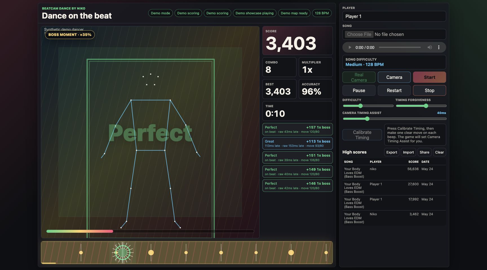
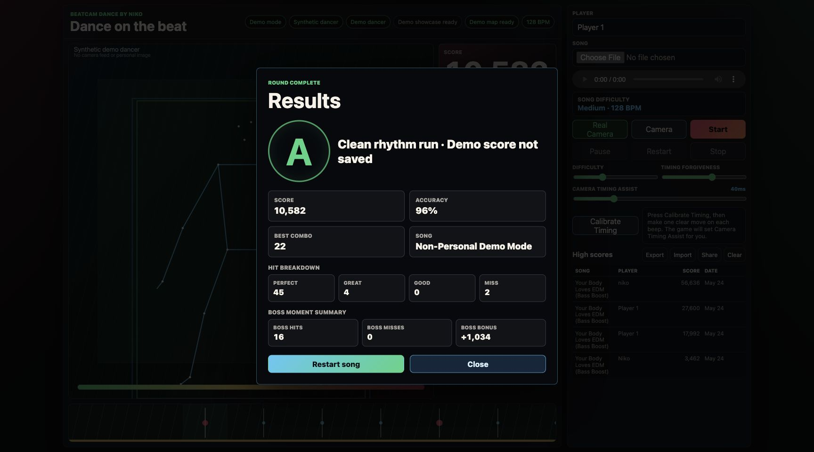

# BeatCam Dance by Niko

BeatCam Dance by Niko is a browser-based webcam dance game. Load a song, turn on the camera, dance on the beat, and score points from body movement instead of fixed choreography.

The game is designed around free movement: you do not have to perform a specific dance. The camera tracks your body, the song is mapped automatically, and the scoring rewards movement that lands near the beat.

## Screenshots





## Hosted Demo

The non-personal demo mode is hosted here:

[https://vivid-crystal-b9y2.here.now/](https://vivid-crystal-b9y2.here.now/)

Use this link for camera-free previews, educational demonstrations, and sharing the project without showing a real person or room. The hosted demo uses the synthetic dancer and does not require camera access.

Uploaded songs are supported in the hosted synthetic-dancer demo. On mobile, MP3, M4A/AAC, and WAV are the recommended formats.

For full webcam gameplay, run the project locally with the instructions below.

## Install and run locally

BeatCam Dance by Niko is a static browser app. There is no `npm install` or build step. To "install" it, put the project folder anywhere on your computer, such as `Desktop`, `Documents`, or a development folder.

### Option 1: Clone with Git

If you have Git installed, open Terminal or Command Prompt and run:

```bash
git clone https://github.com/Niko2756/beatcam-dance-by-niko.git
cd beatcam-dance-by-niko
```

### Option 2: Download ZIP

If you do not want to use Git:

1. Open the GitHub repository page.
2. Click `Code`.
3. Click `Download ZIP`.
4. Unzip the file.
5. Open Terminal or Command Prompt inside the unzipped project folder.

### Start the local server

On macOS or Linux:

```bash
python3 -m http.server 5173
```

On Windows:

```bash
py -m http.server 5173
```

Then open this address in your browser:

```text
http://localhost:5173
```

If port `5173` is already busy, use another port:

```bash
python3 -m http.server 8000
```

Then open:

```text
http://localhost:8000
```

Chrome or Edge is recommended because webcam and MediaPipe pose tracking support is strongest there. Camera access usually requires the page to be served from `localhost` or HTTPS. Opening `index.html` directly may block webcam features in some browsers.

## How to play

1. Click `Camera` and step into frame.
2. Enter your player name.
3. Choose a song, then wait for `Audio map 100%`.
4. Press `Start`.
5. Dance after the countdown.

The song starts after the countdown, so the round begins cleanly with the music.

For a camera-free preview, open the app with `?demo=1`. Demo Mode uses an anonymous synthetic dancer and does not save scores to the leaderboard.

The first-time tutorial walks through the main setup path: Camera, Player, Song, and Start. The tutorial advances automatically when actions are completed, and also has a `Next` button so users can move through the steps manually.

## Non-Personal Demo Mode

Demo Mode is built for screenshots, educational demonstrations, and testing without showing a real face, body, or room.

In Demo Mode:

- The app does not request camera access.
- The camera stage is replaced by an animated synthetic dancer.
- Synthetic pose landmarks feed the same scoring path used by real body tracking.
- Combo, comeback boost, Flow Mode, Boss Moments, beat-lane visuals, and post-song results still run.
- Demo scores are shown in the results modal but are not saved to local high scores.

You can also launch directly into this mode with:

```text
http://localhost:5173?demo=1
```

## Scoring

Each beat can score as:

- `Perfect`
- `Great`
- `Good`
- `Miss`

Timing matters, but movement matters too. A hit needs fresh movement near the beat. Standing still, walking out of frame, or being too close for the tracker to see a playable body view should score as a miss.

The game uses pose tracking when available and falls back to motion tracking if the pose model cannot load. Pose scoring looks for real movement relative to your body, so simple camera drift or slow swaying is filtered more aggressively. Head movement can still score when your full/playable body is visible.

## Song Sections / Boss Moments

After a song is mapped, BeatCam Dance automatically groups the beat map into song sections and looks for the highest-energy parts of the track. Those sections become `Boss Moments`.

Boss Moments are meant to make exciting parts of a song feel more rewarding, not more punishing:

- The game does not raise the difficulty during a Boss Moment.
- Successful hits during a Boss Moment earn bonus points.
- The beat lane and stage glow more strongly while a Boss Moment is active.
- Boss hits, boss misses, and boss bonus points are shown in the post-song results.

If the beat map has very even energy, such as the built-in demo beat or a fallback beat grid, the game still creates a late-song Boss Moment so the feature is visible.

## Game Systems

- Automatic uploaded-song beat and downbeat mapping
- Webcam countdown before music and scoring begin
- Mirrored camera stage with skeleton/body tracking overlay
- Beat lane that shows upcoming beats
- Difficulty slider for movement required
- Timing Forgiveness slider for hit-window size
- Camera Timing Assist slider and calibration mode
- Combo multiplier that grows with longer combos
- Comeback boost after misses, cashed in on the next Good, Great, or Perfect
- Flow Mode after a long Perfect streak
- Song Sections / Boss Moments generated from the song's beat energy
- Non-personal scripted demo mode with synthetic pose scoring
- Cleaner first-time tutorial with Camera, Player, Song, and Start steps
- Recent songs list for previously loaded local song names
- Accuracy, combo, multiplier, best score, and time tracking
- Results screen with hit counts and boss moment summary at the end of each round

## Technical Highlights

- Vanilla HTML, CSS, and JavaScript browser game
- MediaPipe pose tracking with motion fallback
- Local audio beat/downbeat analysis
- Fresh-motion scoring and body-validation anti-cheat logic
- Boss Moment section detection from beat energy
- Synthetic pose generation for camera-free demo gameplay
- Local leaderboard export, import, and share controls

## What I Learned / Engineering Challenges

- Filtering real movement from sway, drift, and stale motion
- Handling body loss, face-only framing, and pose reacquisition
- Aligning webcam movement with music timing
- Designing comeback, flow, and boss systems without forced choreography
- Making a camera-heavy app understandable through UI feedback
- Building a screenshot-safe demo path that still exercises the real scoring system

## Leaderboards

High scores are saved locally in the browser per song and player name.

Leaderboard controls:

- `Export` saves scores as a CSV file.
- `Import` merges a CSV leaderboard back in.
- `Share` uses native sharing when available, or copies leaderboard text.
- `Clear` removes local scores.

Recent song names are also saved locally so a player can see what they played before. Browsers do not allow a web page to reopen local audio files automatically, so recent songs act as a reminder to choose that file again.

## Audio Analysis

Uploaded songs are analyzed locally in the browser. The game estimates tempo, beat positions, downbeats, and song difficulty automatically. If analysis fails, it falls back to a regular beat grid based on the best available BPM estimate.

## Body Tracking

The game uses MediaPipe pose-landmark tracking from a browser CDN when available. It requires a playable body view before pose scoring is active. A face-only closeup should not count as a valid body-tracking state.

If MediaPipe cannot load, the game can still use motion-based camera tracking as a fallback.

## Current Notes

This is an active prototype. The current focus is making scoring feel fair and fun:

- Reward intentional dance movement.
- Prevent easy scoring from standing still, drifting, or face-only framing.
- Keep the full game playable in one desktop viewport without page scrolling.
